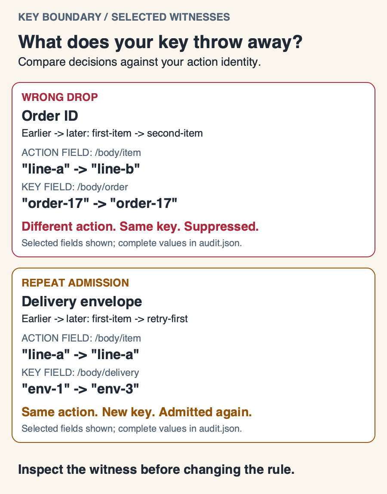
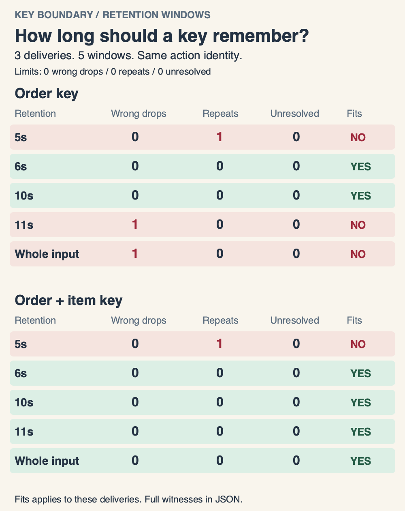

# Key Boundary

A duplicate filter can suppress a second item that really needs processing. It can also admit the same action twice when a retry changes its delivery envelope.

Key Boundary compares candidate keys against **your declared action identity**. It shows each admission, duplicate, wrong drop and repeat admission, with the earlier delivery that explains the decision.

## See the difference



```sh
python3 key_boundary.py examples/deliveries.json --out output/first-audit
```

Open `output/first-audit/focus.svg` for the first wrong-drop and repeat-admission witnesses. The view selects actual disagreements from your audit. When none exists, it says so. It also distinguishes an expired key from a changed key. Long values are shortened in the visual; SVG titles and the JSON report retain full values.

`comparison.svg` shows all deliveries and policies. The included scenario produces:

| Key | First admissions | Wrong drops | Repeat admissions | Duplicates | Needs review |
| --- | ---: | ---: | ---: | ---: | ---: |
| Order ID | 1 | 4 | 0 | 1 | 1 |
| Delivery envelope | 5 | 0 | 1 | 0 | 1 |
| Intended action | 5 | 0 | 0 | 1 | 1 |

The second item, another tenant, a different action and a new revision must remain separate in this scenario. The retry must collapse. The missing item ID stays visibly unresolved.

`audit.html` is an optional static field table beside each witness, highlighting differences. Its output structure is checked automatically; its browser layout has not been visually verified. The verified demonstration centers on the CLI and native SVG reports. `audit.json` contains the exact row decisions, typed field values and witness IDs. All bundled inputs are invented, with no workplace records or external connections. The image above is rendered from the included input, not a hand-authored result.

## Compare retention windows



A longer retention window can fix a repeat admission and then suppress a different item. Compare the same sequence across explicit windows:

```sh
python3 window_study.py examples/window-tradeoff.json --windows 5,6,10,11,all --out output/window-study
```

This sequence has an item at 0 seconds, its retry at 5 seconds, and a different item from the same order at 10 seconds. The order-only key admits the retry with a 5-second window. At 6 and 10 seconds, it makes neither error. At 11 seconds, it wrongly drops the second item. Adding the item to the key prevents that collision, but a 5-second window still admits the retry.

Open `window-study.svg` to compare wrong drops, repeat admissions and unresolved identities. `window-study.json` includes every decision and its witness, plus `changes_from_previous` for each adjacent pair of supplied windows. A witness change is retained even when the status stays the same. Each evaluation starts with an empty cache; windows never share state.

`all` retains keys for the entire input. Windows are sorted and must be distinct positive seconds. The default **Fits** criterion allows zero wrong drops, zero repeat admissions and zero unresolved rows. Explicit `--max-wrong-drops`, `--max-repeat-admits` and `--max-unresolved` options change those thresholds without hiding the counts. Fits describes only the supplied sequence and declared identity; it does not select a safe production timeout. Results need not improve as windows grow.

A study permits up to 32 windows and 128 policy/window combinations. It retains full witnesses for each evaluation, so memory and output size grow with the number of combinations and deliveries. This favors inspectable comparisons over large-stream throughput.

## Define the action before choosing its key

`reference_fields` is a list of JSON Pointers that defines when two deliveries represent the same intended action. It is an explicit assumption, not inferred ground truth. Include an operation, tenant, revision or source event ID when your actual workflow requires it. Object plus event type is not universally sufficient for repeatable operations.

Each entry in `policies` has a unique `name`, a list of `fields`, and an optional positive `window_seconds`. Omit the window for retention across the whole input. A finite window expires exactly at admission time plus the window; suppressed duplicates do not extend it. Deliveries must have unique row `id` values and nonnegative numeric `at` seconds in arrival order. A provider's repeated event ID belongs inside the payload, not in the unique row ID.

Key fields must resolve to nonempty scalar values. Missing, null, empty or compound values produce `unresolved` and do not change simulated state. Numeric zero and false are valid. Keys use typed JSON tuples, avoiding delimiter collisions and the accidental equivalence of boolean `true`, number `1` and string `"1"`. Numeric lexical forms `1` and `1.0` remain distinct; normalize them upstream if your identity treats them as equal. JSON Pointer supports escaped property names and array indexes, although array position usually makes a poor stable identity.

## What this adds

Gateways such as [Hookdeck](https://github.com/hookdeck/hookdeck-cli/blob/main/REFERENCE.md) already support configurable deduplication fields and windows. Key Boundary is a diagnostic complement: compare several rules on one sequence and inspect disagreements with the action identity you specify. It does not implement or reproduce any provider's exact gateway semantics.

[Stripe's webhook guidance](https://docs.stripe.com/webhooks) discusses duplicate deliveries and event identity. Follow your provider's contract when choosing reference fields. The bundled generic payload is not a Stripe adapter.

## Limits and tradeoff

This is a sequential admission model, not a running queue. Admission is assumed to succeed; the tool cannot prove an external side effect happened. It does not simulate worker crashes, concurrency, signatures, network retries or transactional guarantees. A clean result means no disagreements in the supplied input under the declared identity, not proof of production safety.

The reference identity persists across the entire input even if a candidate key expires. That deliberately reveals repeated admissions after expiry. If the same business action is legitimately repeatable, include the distinguishing operation or revision in the reference.

The implementation keeps keys and earlier witnesses in memory for transparent, reproducible decisions. Large streams need a bounded storage design before use at scale. Generated reports contain the supplied row IDs and policy names: review your own inputs before sharing an output.

## Run and verify

Python 3.10 or later; no dependencies, credentials or services required. Output directories must be new to avoid replacing an earlier audit.

```sh
python3 -m unittest discover -s tests -v
```

The suite covers overlapping identities, tenant/action/revision boundaries, typed keys, expiry, missing identities, report witnesses and clean CLI output. The renderer uses only the standard library. The checked-in PNG is a rasterized copy of the generated SVG; generating a new audit does not require an image library.

Licensed under [MIT](LICENSE).
